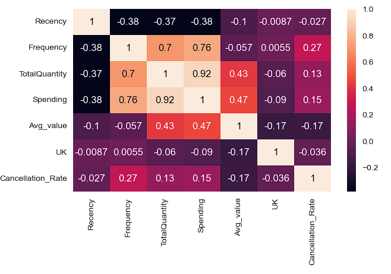
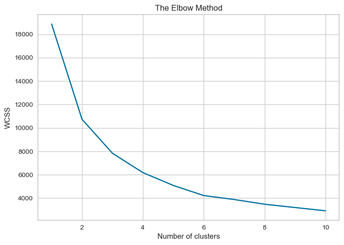
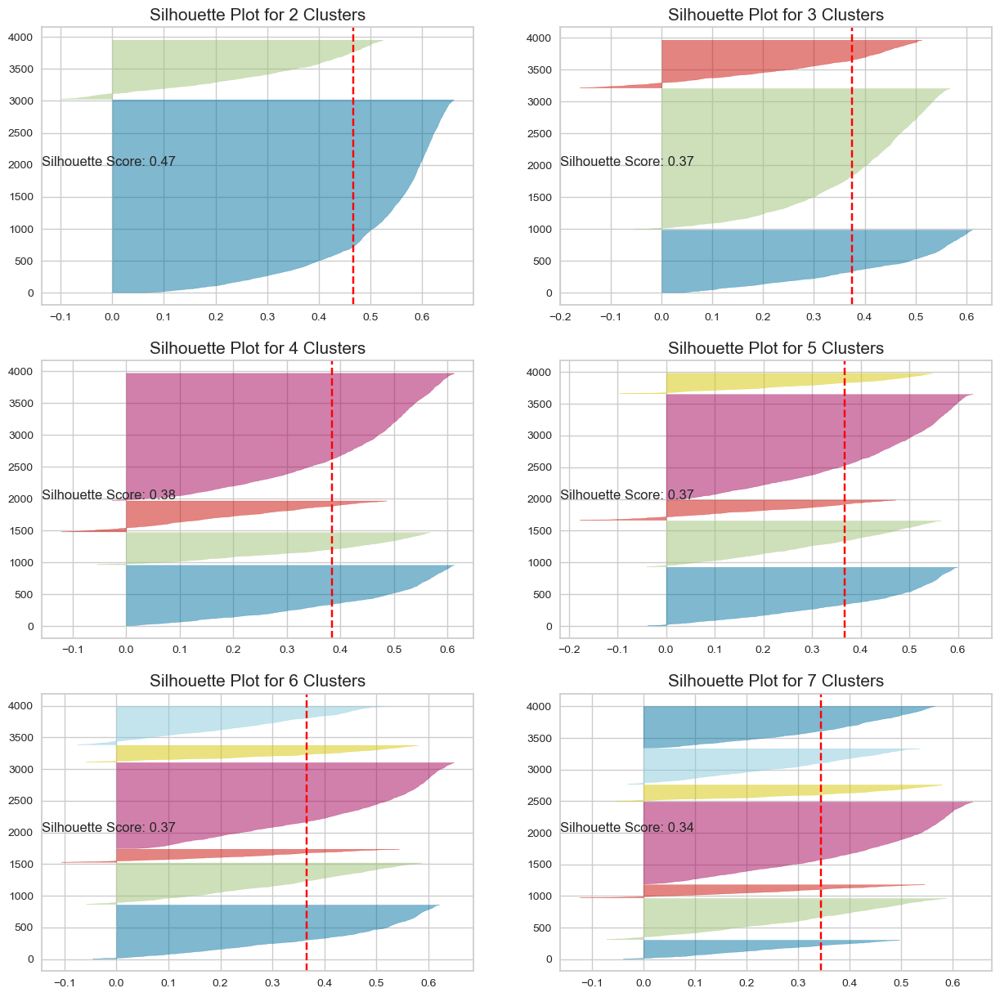
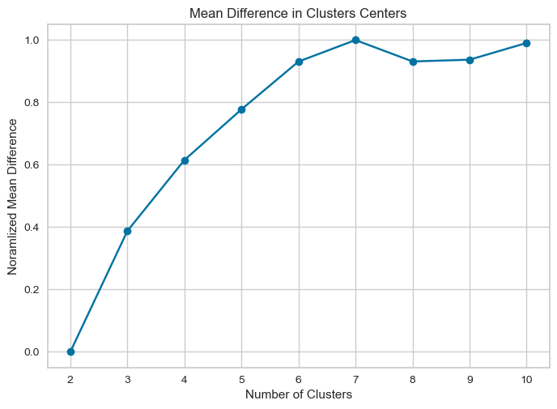
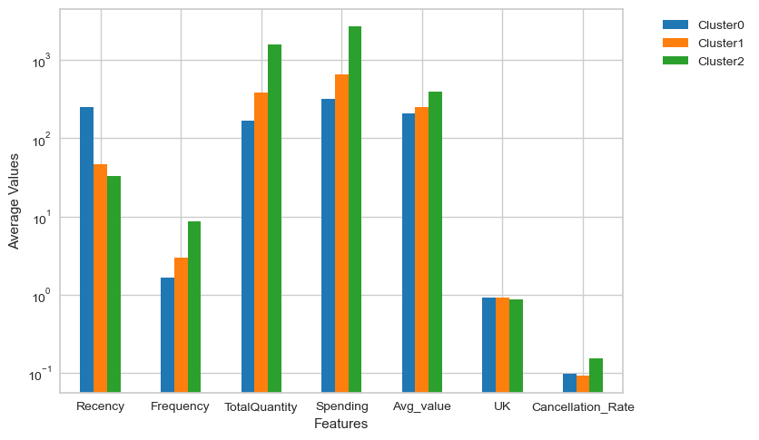
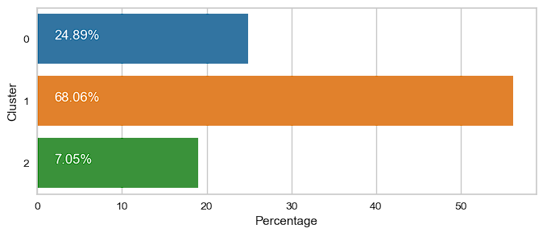

# Online Retail Customer Segmentation

This project delves into the realm of online retail, focusing on a dataset from a UK-based store covering transactions from 2010 to 2011. The primary goal is to enhance marketing and sales strategies by gaining insights into diverse customer segments. Employing K-means clustering, the study analyzes recency, frequency, and monetary aspects, providing a nuanced understanding of customer profiles to refine the store's strategies.

**Keywords:** Recency (R), Frequency (F), Monetary (M), LOF (Local Outlier Factor), PCA (Principal Component Analysis)


Run the following command to clone the repository:
```bash
git clone https://github.com/muhammad-salik-salam/CustomerSegmentation.git
```

## 1. Introduction

This project explores online shopping, aiming to optimize marketing and sales strategies by understanding customer preferences. Key steps include data cleanup, feature engineering, data processing, K-means clustering, and cluster analysis to tailor strategies for distinct customer groups.

## 2. Methodology

### a. Data Pre-processing

Utilizing the Online Retail dataset from [UCI Machine Learning Repository](https://archive.ics.uci.edu/dataset/352/online+retail), the data undergoes comprehensive cleaning, handling missing values, and preparing it for analysis. Columns such as InvoiceNo, StockCode, and CustomerID are pivotal in understanding transaction details.

### b. Feature Engineering

RFM analysis is applied to understand customer behavior. Recency, Frequency, and Monetary aspects are derived to create a customer-focused dataset. Geographic insights and cancellation patterns are also explored to refine segmentation.

### c. Identifying Outliers

Local Outlier Factor (LOF) is employed to identify and address outliers, ensuring accurate clustering results. Outliers constitute 9.7% of the dataset.

### d. Correlation

Correlation analysis identifies strong correlations among variables, prompting the use of Principal Component Analysis (PCA) for dimensionality reduction.   

### e. Principal Component Analysis (PCA)

PCA is applied to reduce feature dimensionality while preserving data variance, ensuring a more stable clustering process.

## 3. K-Means Clustering and Cluster Stability

K-Means clustering is utilized to group customers based on RFM features. The optimal number of clusters is determined using the Elbow Method, Silhouette Score, and Cluster Stability.

### a. Elbow Method

The Elbow Method suggests an optimal cluster count between 3 and 6, with 3 clusters identified as optimal for the dataset.


### b. Silhouette Score

Silhouette Score analysis confirms that 3 clusters yield well-defined clusters with satisfactory cohesion and separation.


### c. Cluster Stability

Cluster Stability assessment further validates 3 clusters, ensuring robustness in cluster assignments.


## 4. Results

Customer segmentation reveals three distinct clusters:

- Cluster 0 (Blue): Conservative spenders with stable and loyal behavior.
- Cluster 1 (Orange): Moderate spenders with potential for growth.
- Cluster 2 (Green): High-value customers with concerns about potential dissatisfaction.



## 5. Conclusion

The segmentation analysis provides insights for personalized marketing and retention strategies. Continuous monitoring and strategy adjustments based on evolving customer trends are crucial for maximizing effectiveness.
